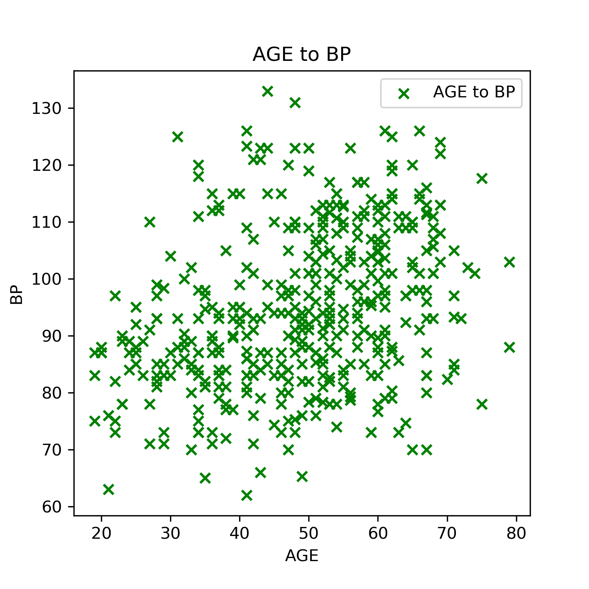
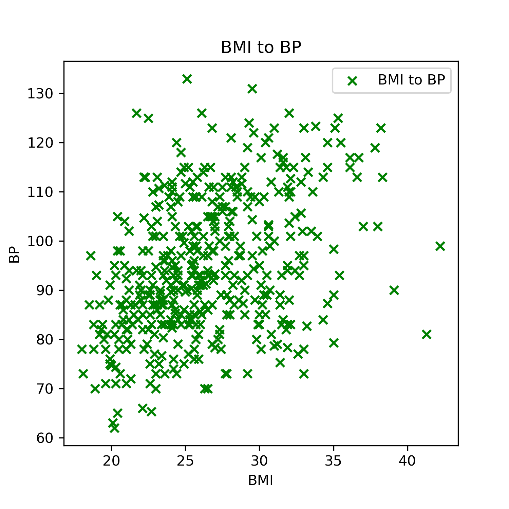

# week-6-assignment
DIABETES DATA ANALYSIS

The diabetes can be analysed in different ways .BP (blood pressure) is one form them to analyse diabetes . Blood pressure (BP) is the pressure of circulating blood on the walls of blood vessels .In both men and women blood pressure increased with aging. if person's age ranges from 30 to 70 then blood pressure tend to 100-120.

BMI (body mass index) is also one of the critical factor to analyze diabetes. body mass index(BMI) is positively associated with blood pressure .in the below graph if BMI is under the 20 to 30 BP is higher.
